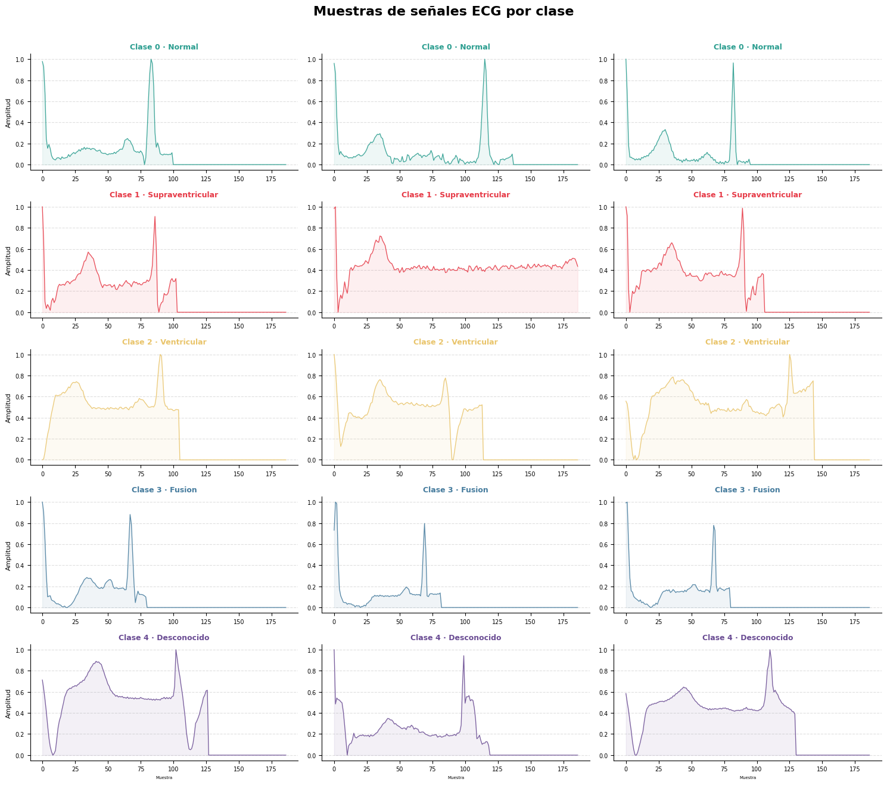
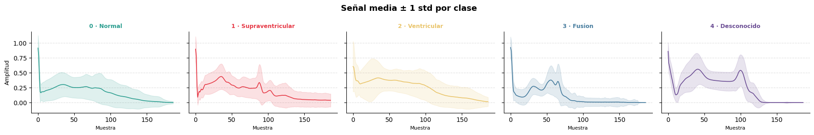
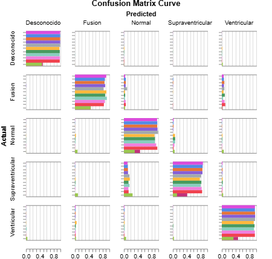

# Clasificador de Latidos ECG — Proyecto Final MLOps

**Autor:** Lucas Silva (Brachi) y Víctor Méndez (Vicmen)
**Máster:** Deep Learning — UPM  
**Asignatura:** MLOps

Proyecto de clasificación de latidos ECG en 5 categorías de arritmia usando una CNN-1D entrenada sobre el dataset MIT-BIH Arrhythmia Database. El objetivo es construir un pipeline MLOps completo que cubra desde la ingesta y preprocesado de datos hasta el despliegue y monitorización del modelo.

#### Descripción del problema

Las arritmias cardíacas son alteraciones del ritmo cardíaco que pueden comprometer gravemente la salud del paciente. La detección automática a partir de señales ECG permite asistir al clínico en el diagnóstico temprano y reducir la carga de revisión manual de registros.

Cada muestra del dataset representa un latido individual segmentado como una señal de 187 puntos temporales, etiquetada en una de las siguientes categorías:

| Clase | Etiqueta | Descripción |
|-------|----------|-------------|
| 0 | Normal | Latido sinusal normal |
| 1 | Supraventricular | Arritmia de origen auricular |
| 2 | Ventricular | Arritmia de origen ventricular |
| 3 | Fusión | Latido de fusión ventrículo-sinusal |
| 4 | Desconocido | No clasificable en las categorías anteriores |

---

#### Dataset

El dataset utilizado es el **MIT-BIH Arrhythmia Database**, preprocesado y disponible en Kaggle. Contiene ~110.000 muestras de entrenamiento y ~22.000 de test con una marcada distribución desbalanceada, dominada por la clase Normal.

---

#### Visualización de señales

Ejemplos representativos de señales ECG para cada clase:



Señal media ± 1 desviación estándar por clase, que muestra los patrones morfológicos característicos de cada arritmia:


---

## Inicio rápido (local)

### 1. Clonar el repositorio y crear el entorno

```bash
git clone https://github.com/Brachingo/ecg-heartbeat-mlops
cd ecg-heartbeat-mlops
```

### 2. Descargar el dataset

Descarga el **ECG Heartbeat Categorization Dataset** de Kaggle:  
<https://www.kaggle.com/datasets/shayanfazeli/heartbeat>

Coloca `mitbih_train.csv` y `mitbih_test.csv` dentro de la carpeta `data/`.

### 3. Entrenar el modelo

```bash
cd src
python train.py --epocas 30 --batch_size 256 --lr 1e-3
```

El mejor checkpoint se guarda en `models/ecg_clasificador.pt`.  
Las métricas y la matriz de confusión se registran automáticamente en W&B.

### 4. Lanzar la API

```bash
uvicorn api.main:app --reload
```

### 5. Ejecutar los tests

```bash
pytest tests/ -v
```

---

## Docker

```bash
# Construir e iniciar
docker compose up --build

# La API estará disponible en http://localhost:8000
```

---

## W&B

- Proyecto: `ecg-heartbeat-mlops`  
- Enlace: [W&B - Brachi-UPM](https://wandb.ai/brachi-upm/ecg-classification-mlops/)

---

## Estructura del proyecto

```
├── api/           Servicio FastAPI
├── data/          Datasets CSV (no versionados en git)
├── models/        Checkpoints entrenados (no versionados en git)
├── notebooks/     Exploración y análisis
├── src/           Entrenamiento, dataset, modelo, predicción
├── tests/         Tests unitarios e integración con pytest
├── images/        Imágenes y gráficos del proyecto
├── Dockerfile
├── docker-compose.yml
└── requirements.txt
```

## Resultados
Después de analizar los datos de todos los experimentos realizados, al ver la matriz de confusión normalizada de cada modelo, podemos definir que el modelo con mejor rendimiento es el modelo entrenado con arquitectura CNN a través de 15 épocas, con learning rate de 1e-3 y un weight decay de 1e-3. Este modelo, no solo es capaz de capturar las clases mayoritarias, sino que también muestra un rendimiento gran rendimiento en las clases minoritarias, lo que se refleja en una matriz de confusión más equilibrada.



Los resultados obtenidos con este modelo son los siguientes:
| Clase | Recall |
|---------|-------|
| Normal | 0.96 |
| Supraventricular | 0.87 |
| Ventricular | 0.96 |
| Fusion | 0.90 |
| Desconocido | 0.99 |

Así que este modelo es el que se ha seleccionado para su despliegue en la API, ya que ofrece un rendimiento sólido en todas las clases, incluyendo las minoritarias, lo que es crucial para una aplicación clínica donde la detección precisa de arritmias es fundamental.